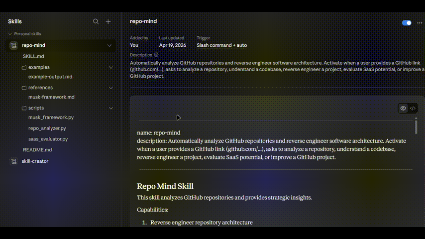
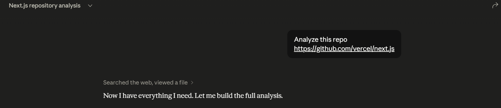
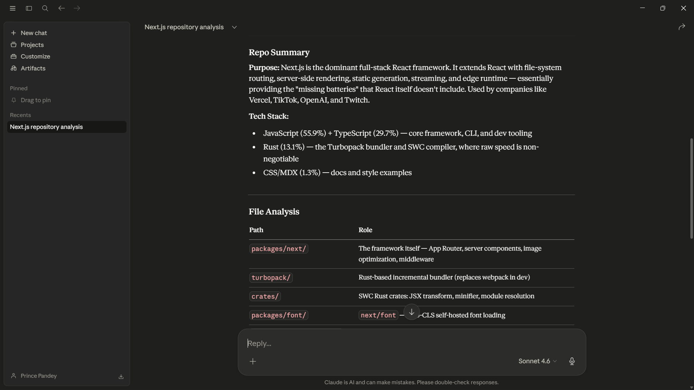
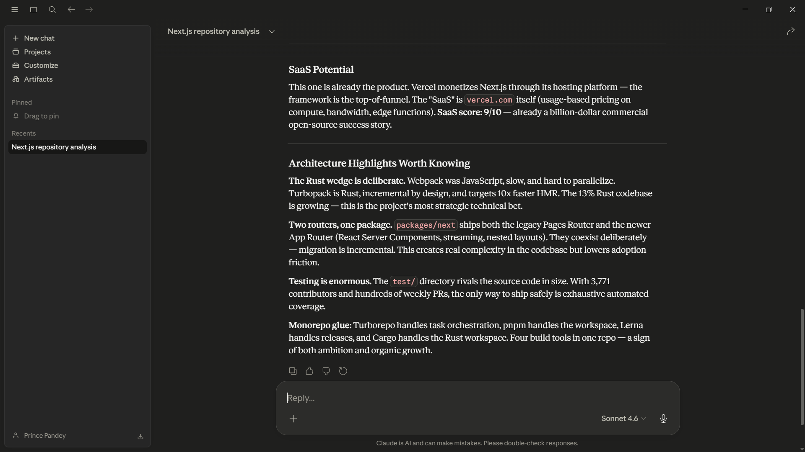
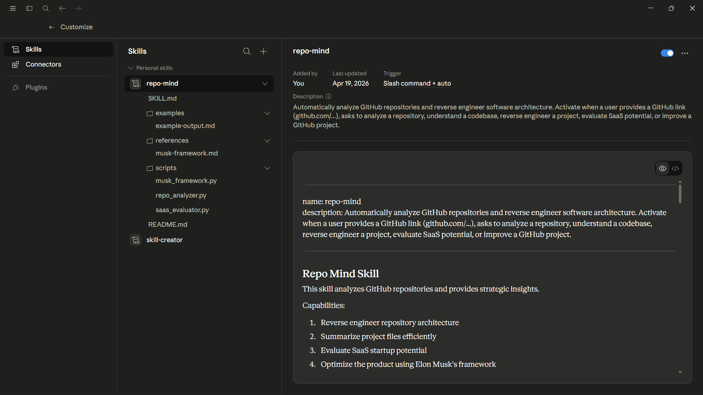

# RepoMind — Claude Skill

## Video Demo

See the full workflow below.



> Turn any GitHub repository into a clear architecture map, explanation, and insights using Claude.

RepoMind is a **Claude Skill** that analyzes a GitHub repository and returns a structured breakdown of the project: architecture, key files, tech stack, and insights.

It is designed for developers who want to **understand unfamiliar repositories in seconds instead of hours**.

---

## What is this?

RepoMind is a **plug‑and‑play Claude Skill**.

Upload the `repo-mind` folder to Claude Skills and then simply paste a GitHub repository link.

Claude will automatically:

• Scan the repository  
• Detect the architecture  
• Explain how the system works  
• Identify key components  
• Generate an architecture map  

This makes exploring open‑source projects dramatically faster.

---

## Demo







---

## Skill Installation

Upload the **repo-mind folder** directly inside Claude's Skills page.



After upload, Claude automatically activates RepoMind when it detects a GitHub repository link.

---

## How to Use

Simply paste a GitHub repository link in Claude.

Example:

```
Analyze this repository:

https://github.com/vercel/next.js
```

Claude will return:

• Repository summary  
• Technology stack  
• Architecture explanation  
• Key directories  
• Important files  
• Design insights  

---

## Example Architecture Output

RepoMind can even generate visual architecture maps for large projects.



This helps developers understand complex codebases instantly.

---

## Project Structure

```
repo-mind/
 ├─ SKILL.md
 ├─ prompts/
 ├─ rules/
 └─ README.md
```

This folder can be uploaded **as‑is** to Claude.

No changes required.

---

## Why RepoMind Exists

Developers waste massive amounts of time trying to understand new repositories.

Typical workflow:

1. Clone repo
2. Read README
3. Browse folders
4. Open random files
5. Try to mentally reconstruct architecture

RepoMind compresses that entire process into **one prompt**.

---

## Who This Is For

• Developers exploring open source  
• Engineers onboarding to new codebases  
• Builders researching startup ideas  
• AI engineers analyzing repos quickly  

---

## Future Upgrades

Planned improvements:

• One‑command repository analysis  
• Startup‑idea mode from repos  
• Automatic architecture diagrams  
• Large‑repo token optimization  

---

## License

MIT License
